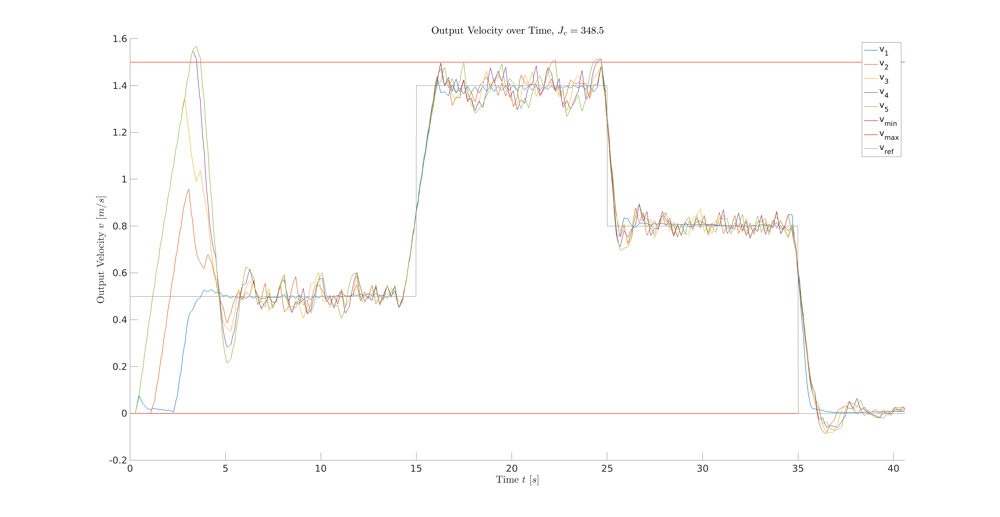

# Lab Exercise for "Control and Perception in Networked and Autonomous Vehicles"
This repository provides a starting point for the lab exercises of the course "Control and Perception in Networked and Autonomous Vehicles". You can find the [course material on the CPM Lab website](https://cpm.embedded.rwth-aachen.de/course-materials/).

The code is organized as MATLAB packages in respective folders. 

The folder `+cmmn` provides functionality which is shared between exercises.

Run the lab exercises in the [CPM Lab](https://github.com/embedded-software-laboratory/cpm_lab).
The folder in which this code resides is expected to be `software/high_level_controller/`.

# I. Problem Formulation
Control the vehicles as a platoon to drive along the predefined path, such that the leading vehicle follows a predefined reference velocity trajectory *v_ref* and other vehicles should maintain a constant distance *d_ref* to their front vehicles while considering the constraints in the Tab. 1.

<p style="text-align:center;">

</p>

Tab. 1: *d_min* refers to the minimal distance each vehicle should keep, *v_min*, *v_max*, *a_min* and *a_max* are minimal and maximal velocity, minimal and maximal acceleration, respectively.

More concretely, in this lab exercise five vehicles will be controlled to form a platoon, with vehicle *IDs = [1,2,3,5,7]*, where the higher the vehicle's ID, the fronter the vehicle will be in the platoon. We notate the vehicle with *ID n* as *vn*, for example, vehicle with *ID 7* will be notated as *v7*. In the platoon, the vehicle *v5* follows *v7*, *v3* follows *v5*, *v2* follows *v3*, *v1* follows *v2*. Thus, vehicle with *ID 7* will be the leading vehicle of the platoon and vehicle with *ID 1* will be the last vehicle.

# II. Networked Model Predictive Control (MPC) Strategies
The main task of this lab exercise is to implement different networked MPC strategies for networked and autonomous vehicles, especially the centralized MPC (CMPC) and distributed MPC (DMPC). Specifically, we will use priority based non-cooperative DMPC [1] for this lab exercise. At the end, the performance of these two kinds of networked MPC will be compared. At first, vehicle model is needed for MPC. Here we will use a linear discrete state-space model for MPC to predict vehicles' behavior; thus, the non-linear behavior of the vehicle will be approximated using linear state-space model. For model identification, the step response of the vehicle will be experimentally collected and analyzed using MATLAB's System Identification Toolbox (`ssest`). The identified system parameters are included in the system matrix *A*, input matrix *B* and output matrix *C*. This linear state-space model will be used throughout the total lab exercise. The implemented MPC strategies will be tested using simulation and experiment. The experiment will be carried out in [Cyber-Physical Mobility Lab](https://github.com/embedded-software-laboratory/cpm_lab) at the [Chair of Embedded Software](http://embedded.rwth-aachen.de/) at [RWTH Aachen University](http://rwth-aachen.de/), where 20 networked model-scale (1:18) vehicles with maximum speed of 3.7 *m/s* can be used.

## a. Centralized Platoon Control
CMPC will be used in centralized platoon control. CMPC is characterized by the existence of a center controller that solves the optimization problem for the whole platoon and then send the optimized control input to each vehicle [1, p. 36]. The coupling and communication graph are shown in Fig. 1. Each vehicle communicates its states, reference trajectory and system parameters to the center controller. Therefore, the center controller has the complete information of the networked control system, which is able to form a single optimization problem. After solving the optimization problem, the center controller sends the optimal control input to each vehicle. The center controller plans for each vehicle under the consideration of all other vehicles' objective function and constraints, which leads to a fully connected coupling graph. The coupling and communication graphs are shown in Fig. 1.

<p style="text-align:center;">


Fig.1: Coupling and communication graphs of CMPC strategy, where, for example, *v7* stands for vehicle with *ID 7*.
</p>

To form a centralized optimization problem, we firstly find a suitable state-space representation for the five vehicles. Specifically, the networked control system will be represented by a whole system matrix *A_total*, input matrix *B_total* and output matrix *C_total*. The output of the system is a five-dimensional vector. The first element is the velocity of the leading vehicle, the other four elements are the inter-vehicle distances. Thus, the optimization problem of the CMPC is to find an optimal input trajectory, which minimize the leading vehicle's velocity error and the inter-vehicle distance error under consideration of velocity and acceleration constraints. The optimization problem will be formed as a quadratic objective function with linear constraints such that it can be solved using MATLAB toolbox `quadprog`. The simulation recording is shown in Fig. 2 and the simulation results are shown in Fig. 3 and Fig. 4. The sum of squared error (SSE) of velocity tracking is shown in Fig. 3 with *J_v = 345.4* and the SSE of distance tracking is shown in Fig. 4 with *J_d = 303.4*, which leads to the total SSE with *J_total = J_v + J_d = 648.8*. In the next section we could conclude that the SSE of both velocity and distance are far more less than those of the DMPC strategy. The drawbacks of the CMPC will also be discussed in the section III.

<p style="text-align:center;">


 Fig. 2: Simulation recording using CMPC strategy. The number marked in the vehicle is its vehicle *ID*.
</p>

<p style="text-align:center;">
 

 Fig. 3: Output velocity of each vehicle using CMPC strategy, where the upper and lower red horizontal lines represent the velocity input constraints, and the gray line represents the reference of the leading vehicle *v1*.
</p>

<p style="text-align:center;">


Fig. 4: Inter-vehicle distances using CMPC strategy, where the lower red horizontal line represents the minimal distance constraint and for example, *v_75* stands for the distance between vehicle with *ID 7* and *ID 5*.
</p>

## b. Distributed Platoon Control
DMPC will be used in distributed platoon control. There are two kinds of DMPC, cooperative DMPC and non-cooperative MPC. The main difference between them is that the former considers other vehicles' objective function while the latter not. In this lab exercise, non-cooperative DMPC will be used. To deal with the prediction inconsistence problem [1, p. 49] of the non-cooperative DMPC, in [1, p. 51] a novel non-cooperative DMPC is proposed, where each vehicle will be prioritized. The priority-based non-cooperative DMPC can reduce computation time as well using appropriate parallel computation. In our simple scenario, priority can be easily assigned: leading vehicle *v7* has the highest priority, second vehicle *v5* has the second highest priority, and so on. The coupling and communication graphs are shown in Fig. 5. The optimization problem is solved sequentially (see Tab. 2). In the `for-loop`, the leading vehicle's optimal input trajectory will be firstly calculated; then, the leading vehicle's predicted position under applying the optimal control input trajectory will be send to the second vehicle to calculate its reference position for the optimization problem. This will be repeated until every vehicle's optimal control input is calculated. Finally, the optimal control inputs will be applied to each vehicle. Though in each step *N* (number of vehicles) optimization problems are solved, the total computation time is still lower than CMPC because the number of decision variables and constraints of each optimization problem in DMPC is far less than the single optimization problem in CMPC, which makes the optimal solution easier to be found. 

<p style="text-align:center;">


Fig. 5: Coupling and communication graphs of DMPC strategy, where *v7* is the leading vehicle with the highest priority, *v1* is the last vehicle of the platoon with the lowest priority. Both coupling and communication graphs are directed because only back vehicle should consider the front vehicle.
</p>

Tab. 2: Pseudocode of sequential computation
```
u_total = zeros(N,1) # initialize the control input for the whole platoon (totally N vehicles)

for i=1:N
  if i == 1 # leading vehicle
    [u_1,y_1] = optimizeMPC(v_ref) # solve the optimization problem with reference velocity trajectory as input
    u_total(1) = u_1(1)
  else # other vehicles
    [u_i,y_i] = optimizeMPC(y_(i-1)) # solve the optimization problem with position of the front vehicle as input
    u_total(i) = u_i(1)
  end
end

applyInput(u_total) # apply the optimal control input to the platoon
```
The simulation recording is shown in Fig. 6 and the simulation results are shown in Fig. 7 and Fig. 8. Fig. 7 demonstrates that the SSE of velocity tracking is *J_v = 523.2* and the SSE of distance tracking is *J_d = 495.1*. The total SSE is therefore *J_total = J_v + J_d = 1018.3*.

<p style="text-align:center;">


 Fig. 6: Simulation recording using DMPC strategy. The number marked in the vehicle is its vehicle *ID*.
</p>

<p style="text-align:center;">
 

 Fig. 7: Output velocity of each vehicle using DMPC strategy, where the upper and lower red horizontal lines represent the input velocity constraints.
</p>

<p style="text-align:center;">


Fig. 8: Inter-vehicle distances using DMPC strategy, where the lower red horizontal line represents the minimal distance constraint and for example, *v_75* stands for the distance between vehicle with *ID 7* and *ID 5*.
</p>

## III. Discussion
In both CMPC and DMPC, the predictive horizon *Hp* is chosen to be 25 and control horizon *Hu* is chosen to be 12. *Hp* will be chosen such that the vehicle's dynamic will be covered by the whole predictive horizon and *Hu* should not exceed *Hp*. Normally, we can have a large control horizon, but considering the model used by MPC is an approximated linear model, we decide to choose *Hu* to be about a half of *Hp*. For comparison reason, the sample time for both CMPC and DMPC is 0.2 *s*. Note that a smaller sample time for DMPC can be chosen, for example 0.1 *s*, because later we can see that DMPC needs less computation time compared with CMPC.

The performances and computation time of CMPC and DMPC are compared in the Tab. 3. The performance of CMPC is obviously higher than DMPC. The SSE of the velocity tracking of CMPC is 345.5, which is about 50% lower than DMPC and the SSE of distance tracking of CMPC is almost 65% lower compared to DMPC. However, CMPC strategy needs 96 *ms* per step in average to solve the optimization problem, which is more than 30% compared to DMPC. The worst-case computation time of CMPC with 178 *ms* per step is 50% more than that of DMPC. This means a higher sample time is required when using CMPC strategy. For more vehicles, the computation time of CMPC grows exponentially, which makes it unsuitable for large-scale system. In addition, CMPC requires more complex communication system and has a single point of failure because it has only one controller, namely center controller [1, p. 38]. Compare to CMPC, DMPC is a good alternative to be used in the networked and autonomous vehicles, which has the advantage of low computation, though the performance is lower the CMPC. Its main advantage is the scalability. Using priority assignment to let optimization problems solved sequentially, the prediction inconsistency problem of traditional DMPC is addressed.

<p style="text-align:center;">


Tab. 3: Comparison of CMPC and DMPC strategies in the sense of performance and computation time.
</p>

# Reference
[1] Alrifaee, Bassam. Networked model predictive control for vehicle collision avoidance. Diss. Dissertation, RWTH Aachen University, 2017, 2017.
